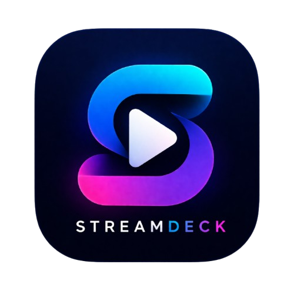

# StreamDeck Mobile 📱

<div align="center">
  
  <p><strong>Your Ultimate Mobile Entertainment Hub</strong></p>
</div>

---

## 📖 Description

**StreamDeck Mobile** is a unified, premium entertainment hub for Android devices. It seamlessly aggregates your favorite content across top streaming platforms (Netflix, Amazon Prime Video, Disney+, Apple TV, and more) into one stunning, fluid mobile interface. 

With dedicated sections for live sports, regional trending content, and an integrated "Add to Library" feature, StreamDeck brings the entire world of digital entertainment into a single application.

### 📥 Download
[**Download Latest APK**](https://github.com/prashantjurel/streamdeck-mobile-android/releases/latest)

*(Note: This repository contains the source code for the **Android Mobile** application. Companion applications for iOS and Android TV are managed in separate repositories.)*

---

## ✨ Features

- **Unified Discovery**: Browse trending movies and TV shows across multiple platforms from a single interface.
- **Dynamic Content Regions**: Customize your feed based on your region (e.g., see what's trending on Netflix India vs. Netflix US).
- **Live Sports Hub**: Track live scores, upcoming fixtures, and stream live sports (Cricket, Football, F1) seamlessly.
- **Smart Deep Linking**: Found a movie? StreamDeck automatically opens it in the native provider app (if installed) or falls back to an integrated web view.
- **Personal Library**: Save movies and shows to your personal watchlist for quick access later.
- **Immersive UI**: Features a modern, glassmorphism-inspired design with dynamic ambient gradients that adapt to the content you are viewing.

---

## 🛠 Tech Stack

- **Framework**: [React Native](https://reactnative.dev/) (New Architecture Enabled)
- **Language**: JavaScript / ES6+
- **Navigation**: React Navigation (Bottom Tabs, Stack Navigation)
- **Data & APIs**: 
  - TMDB API (Movies & TV Shows)
  - ESPN API (Live Sports)
- **Storage**: AsyncStorage for local caching and user preferences
- **UI/UX**: Custom components, Linear Gradients, FastImage
- **Build System**: Gradle with optimized C++ TurboModules

---

## 🚀 How to Run the App

### Prerequisites
- Node.js (v18+)
- Java Development Kit (JDK 17)
- Android Studio & Android SDK
- Android physical device or emulator

### 1. Clone the Repository
```bash
git clone https://github.com/yourusername/streamdeck-mobile.git
cd streamdeck-mobile
```

### 2. Install Dependencies
```bash
npm install
# or
yarn install
```

### 3. Configure API Keys
Create a `.env` file in the root directory and add your TMDB API Key:
```env
TMDB_API_KEY=your_api_key_here
```
*(Alternatively, you can set this up directly inside the app via the Settings Screen).*

### 4. Cloud Sync Setup (Optional)
To enable **Cloud Sync** (saving your Library and Settings to the cloud), you must provide your own Firebase configuration:
1. Create a project in the [Firebase Console](https://console.firebase.google.com/).
2. Add an Android app with the package name `com.streamdeck.mobile`.
3. Download the `google-services.json` and place it in the `android/app/` directory.
4. Ensure you register your debug/release **SHA-1 fingerprints** in the Firebase settings to enable Google Sign-In.

### 5. Run the App
Start the Metro Bundler:
```bash
npx react-native start
```

In a new terminal window, compile and run the app on your Android device/emulator:
```bash
npx react-native run-android
```

---

## 📸 Screenshots

| Home Feed | Explore & Search | Live Sports |
| :---: | :---: | :---: |
|  |  |  |

---

## 📺 Future Roadmap (Android TV)

While this repository focuses exclusively on the mobile experience, the **StreamDeck Android TV** application will be built to mirror these core features, optimized for the 10-foot UI experience:
- Larger, remote-friendly horizontal carousels.
- D-Pad navigation support.
- Immersive background artwork projection.

---

## 🤝 Contribution Guidelines

We welcome contributions to make StreamDeck even better!

1. **Fork** the repository.
2. **Create a branch** for your feature or bug fix (`git checkout -b feature/amazing-feature`).
3. **Commit** your changes (`git commit -m 'Add amazing feature'`).
4. **Push** to your branch (`git push origin feature/amazing-feature`).
5. Open a **Pull Request**.

### Coding Standards
- Prefer functional components and React Hooks.
- Ensure any new UI components match the existing dark-mode/glassmorphism aesthetic.
- Do not commit sensitive API keys or credentials.

---

## 📄 License

This project is licensed under the MIT License - see the LICENSE file for details.
